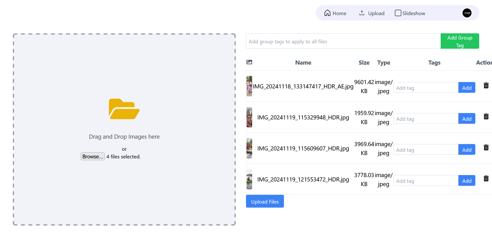
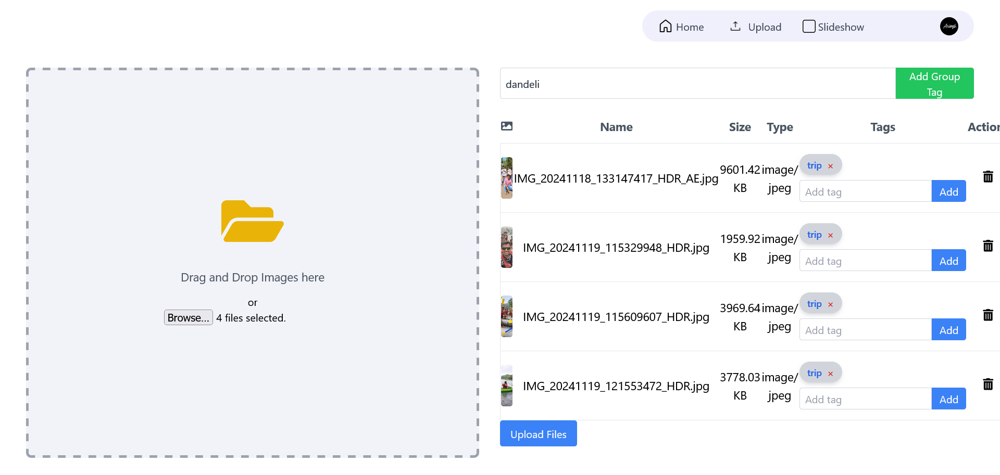
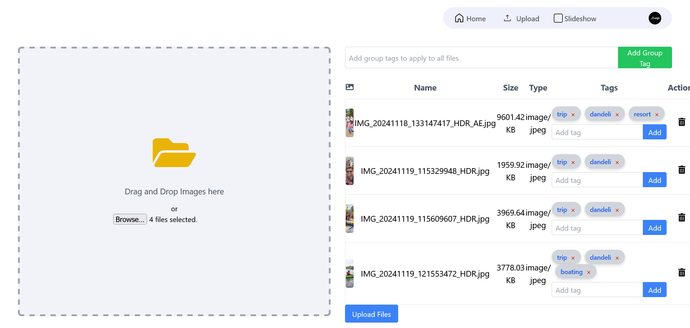
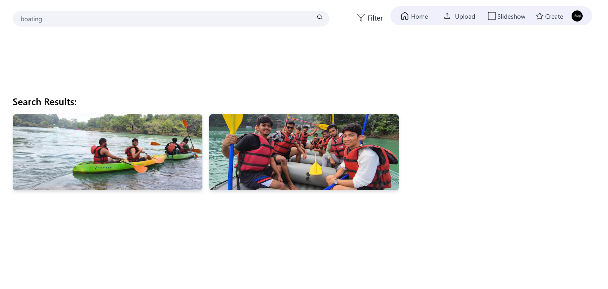
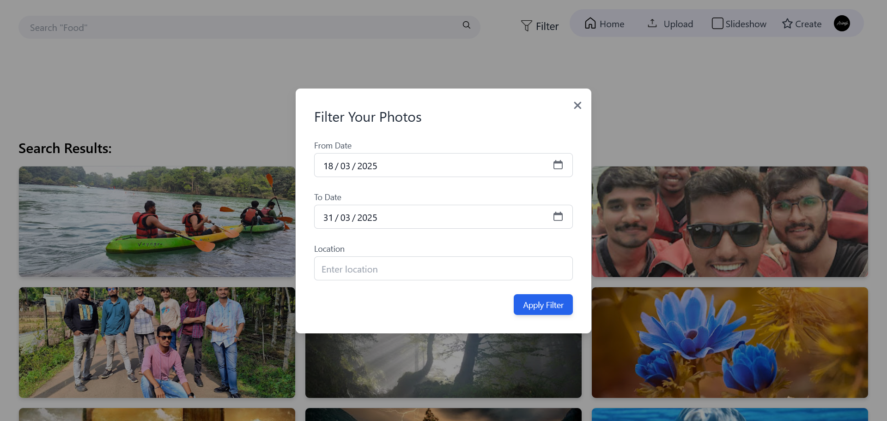
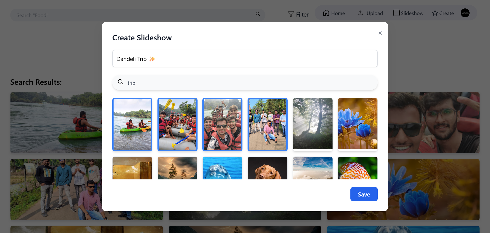
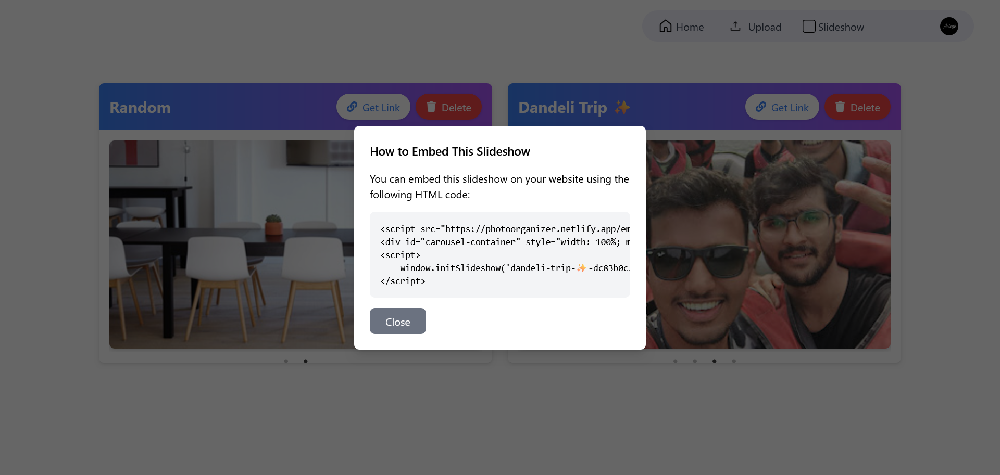
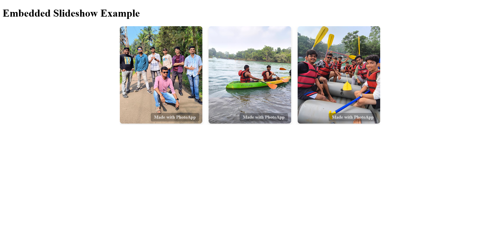

# 📸 **Google Photos Organizer**  

**Google Photos Organizer** is a web-based tool that enhances the organization and accessibility of Google Photos. With seamless integration, it allows users to upload, tag, search, and create interactive slideshows effortlessly.  

## 🚀 **Features**  

🔹 **Upload Photos** – Directly upload images to Google Photos via the application.  
🔹 **Tag Management** – Add, group, delete, and customize tags for better organization.  
🔹 **Google Login** – Secure authentication using Google OAuth.  
🔹 **Photo Organization** – View images date-wise and filter them using a date range.  
🔹 **Advanced Search** – Locate photos using custom tags.  
🔹 **Memory Slideshow** – Create and personalize photo slideshows.  
🔹 **Website Integration** – Generate embed links to showcase slideshows on external websites.  

---

## 🖥️ **Application Screenshots**  

### 🔹 **Main Interface**  
> The home screen provides an intuitive dashboard for accessing all features, including uploading, tagging, searching, and slideshow creation.  
  

### 🔹 **Uploading Photos**  
> Easily upload images from your device to your Google Photos library.  
  

### 🔹 **Tagging System**  
> Add single or multiple tags while uploading for better photo categorization.  
  
  

### 🔹 **Photo Search & Filtering**  
> Quickly search for photos using tags or filter them by date range.  
  
  

### 🔹 **Slideshow Creation**  
> Select photos and transform them into a beautiful slideshow.  
  
  

### 🔹 **Embedding Slideshow on Website**  
> Copy the embed code to integrate the slideshow into any external website.  
  
  

---

## 🛠️ **Technology Stack**  


[](https://nodejs.org/)
[](https://expressjs.com/)
[](https://reactjs.org/)

| Component    | Technology Used       |
|-------------|----------------------|
| **Frontend** | React.js, Tailwind CSS |
| **Backend** | Node.js, Express.js  |
| **Database** | MongoDB  |
| **Authentication** | OAuth 2.0 (Google Login)  |
| **APIs** | Google Photos API  |

---

## 🔧 **Installation & Setup**  


## 🐳 Docker

### 🔧 Run with Docker

```bash
docker-compose up --build
```

- Frontend: [http://localhost:3000](http://localhost:3000)  
- Backend API: [http://localhost:5000](http://localhost:5000)

To stop:

```bash
docker-compose down
```

Follow these steps to run the project locally:  

1️⃣ **Clone the repository:**  
```sh
git clone https://github.com/Ciresta/PhotoOrganizer-WebApp.git
cd PhotoOrganizer-WebApp
```  

2️⃣ **Install dependencies for frontend and backend:**  
   - Navigate to the `frontend` directory and install dependencies:
   ```sh
   cd frontend
   npm install
   ```

   - Navigate to the `backend` directory and install dependencies:
   ```sh
   cd ../backend
   npm install
   ```

3️⃣ **Set up environment variables:**  
   Create a `.env` file in the `backend` folder and add the following:  
   ```
   OAUTH_API=your-oauth-api-id
   OAUTH_SECRET=your-oauth-secret
   OAUTH_CALLBACK=callback-url
   MONGO_URI=your-mongodb-connection-string
   ```

4️⃣ **Run the application locally:**  
   - Run the backend:
   ```sh
   cd backend
   nodemon start
   ```

   - In a new terminal, run the frontend:
   ```sh
   cd frontend
   npm start
   ```

---

## 📜 **License**  

This project is licensed under **[GNU General Public License v3.0](LICENSE)**. Please refer to the license file for details on usage and distribution.  

---

## 📞 **Support & Contact**  

For support, inquiries, or feature requests, reach out via:  
📧 Email: [abhisheksinghfulanekar321@gmail.com](mailto:abhisheksinghfulanekar321@gmail.com)  
🐙 GitHub Issues: [Report an Issue](https://github.com/Ciresta/PhotoOrganizer-WebApp/issues)  

---

## 🌐 **Get Started**  

The app is hosted on **[Google Photos Organizer](https://photoorganizer.netlify.app/)**.  

To view Swagger API Documentation **[API Documentation](https://photo-org-app.onrender.com/api-docs/)**. 

If you'd like to use the application, please fill out the form for the GCP access:  
[**Sign-up Form**](https://forms.gle/LUPKBcd4STaRrm7k6)
