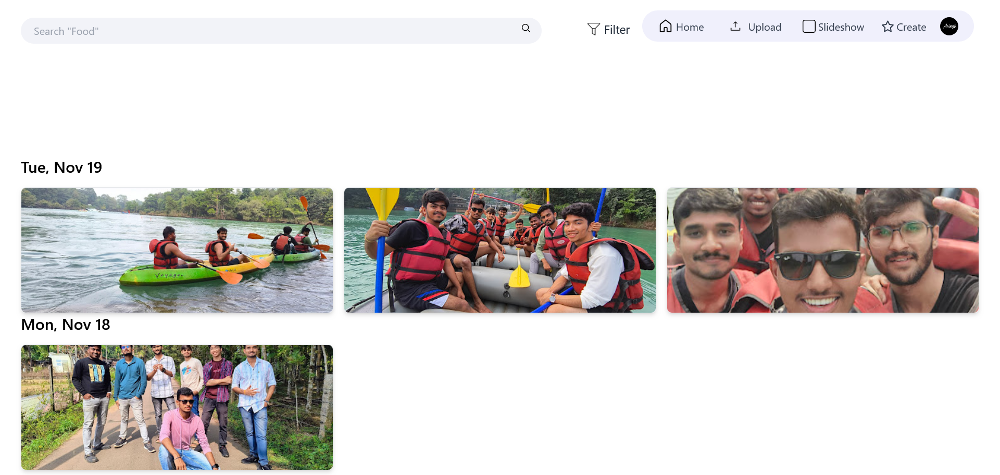

Here’s a **professional and well-structured README** for your client project, following best GitHub practices:  

---

# 📸 **Google Photos Organizer**  

**Google Photos Organizer** is a web-based tool that enhances the organization and accessibility of Google Photos. With seamless integration, it allows users to upload, tag, search, and create interactive slideshows effortlessly.  

---

## 🚀 **Features**  

🔹 **Upload Photos** – Directly upload images to Google Photos via the application.  
🔹 **Tag Management** – Add, group, delete, and customize tags for better organization.  
🔹 **Google Login** – Secure authentication using Google OAuth.  
🔹 **Photo Organization** – View images date-wise and filter them using a date range.  
🔹 **Advanced Search** – Locate photos using custom tags.  
🔹 **Memory Slideshow** – Create and personalize photo slideshows.  
🔹 **Website Integration** – Generate embed links to showcase slideshows on external websites.  

---

## 🖥️ **Application Screenshots**  

### 🔹 **Main Interface**  
> The home screen provides an intuitive dashboard for accessing all features, including uploading, tagging, searching, and slideshow creation.  
  

### 🔹 **Uploading Photos**  
> Easily upload images from your device to your Google Photos library.  
  

### 🔹 **Tagging System**  
> Add single or multiple tags while uploading for better photo categorization.  
  
  

### 🔹 **Photo Search & Filtering**  
> Quickly search for photos using tags or filter them by date range.  
  
  

### 🔹 **Slideshow Creation**  
> Select photos and transform them into a beautiful slideshow.  
  
  

### 🔹 **Embedding Slideshow on Website**  
> Copy the embed code to integrate the slideshow into any external website.  
  
  

---

## 🛠️ **Technology Stack**  

| Component    | Technology Used       |
|-------------|----------------------|
| **Frontend** | React.js, Tailwind CSS |
| **Backend** | Node.js, Express.js  |
| **Database** | MongoDB  |
| **Authentication** | OAuth 2.0 (Google Login)  |
| **APIs** | Google Photos API  |

---

## 🔧 **Installation & Setup**  

Follow these steps to run the project locally:  

1️⃣ **Clone the repository:**  
```sh
git clone https://github.com/your-repo/google-photos-organizer.git
cd google-photos-organizer
```  

2️⃣ **Install dependencies:**  
```sh
npm install
```  

3️⃣ **Set up environment variables:**  
Create a `.env` file and add the following:  
```
GOOGLE_CLIENT_ID=your-client-id
GOOGLE_CLIENT_SECRET=your-client-secret
MONGO_URI=your-mongodb-connection-string
```  

4️⃣ **Run the application:**  
```sh
npm start
```  

---

## 🚀 **Deployment Guide**  

For production deployment, configure the following:  
✅ Host the frontend on **Vercel/Netlify**  
✅ Deploy the backend using **Heroku, AWS, or DigitalOcean**  
✅ Store environment variables securely in **.env files or cloud-based secrets manager**  

---

## 📜 **License**  

This project is licensed under **[MIT License](LICENSE)**. Please refer to the license file for details on usage and distribution.  

---

## 📞 **Support & Contact**  

For support, inquiries, or feature requests, reach out via:  
📧 Email: [your-email@example.com](mailto:your-email@example.com)  
🐙 GitHub Issues: [Report an Issue](https://github.com/your-repo/issues)  
